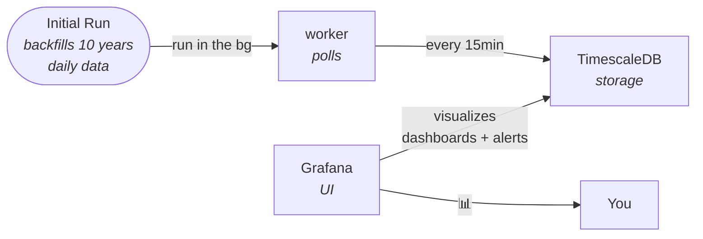

# markets-o11y

Self-hosted market observability for stocks, commodities, forex, and crypto.



No accounts. No API keys. No cloud. Just `docker compose up` or deploy to Kubernetes.

> **Note:** This project uses [yfinance](https://github.com/ranaroussi/yfinance) to fetch data from Yahoo Finance. It does not distribute any data. Each user is responsible for complying with Yahoo's [Terms of Service](https://legal.yahoo.com/us/en/yahoo/terms/otos/index.html).

|                                     Last 12 hours                                     |                                    Last 5 years                                     |
| :-----------------------------------------------------------------------------------: | :---------------------------------------------------------------------------------: |
| <a href="docs/screenshot-12h.png"></a> | <a href="docs/screenshot-5y.png"></a> |

**Blog post:** How it works - https://www.atasasmaz.com/p/markets-o11y

## Getting Started

**Prerequisites:** [Docker](https://docs.docker.com/get-docker/) and [Docker Compose](https://docs.docker.com/compose/install/).

```bash
git clone https://github.com/atas/markets-o11y.git
cd markets-o11y
cp config.example.yaml config.yaml  # customize your watchlist
cp .env.example .env                # default DB & Grafana credentials
docker compose up
```

That's it. Open [http://localhost:3000](http://localhost:3000) and log in with **admin / admin**.

On first run, the worker backfills up to 10 years of daily history for every symbol, then polls every 15 minutes for intraday prices.

## Configuration

Edit `config.yaml` to add or remove symbols:

```yaml
defaults:
  fetch_interval: 15m
  history_years: 10

symbols:
  - symbol: AAPL
  - symbol: SAP.DE
    fetch_interval: 30m  # per-symbol override
  - symbol: GC=F        # Gold futures
  - symbol: EURUSD=X
  - symbol: BTC-USD
```

Any ticker supported by [yfinance](https://github.com/ranaroussi/yfinance) works:

| Type        | Format                   | Examples                        |
| ----------- | ------------------------ | ------------------------------- |
| US Stocks   | Plain ticker             | `AAPL`, `MSFT`, `GOOGL`         |
| EU Stocks   | Ticker + exchange suffix | `SAP.DE`, `MC.PA`, `ASML.AS`    |
| Commodities | `=F` suffix              | `GC=F` (gold), `CL=F` (oil)     |
| Forex       | `=X` suffix              | `EURUSD=X`, `GBPUSD=X`          |
| Crypto      | `-USD` suffix            | `BTC-USD`, `ETH-USD`            |
| Indices     | `^` prefix               | `^GSPC` (S&P 500), `^DJI` (Dow) |

See [`config.example.yaml`](config.example.yaml) for the full default watchlist.

## How It Works

The **worker** fetches OHLCV data from Yahoo Finance via yfinance and writes it to a **TimescaleDB** hypertable. **Grafana** reads from that same database with pre-provisioned dashboards.

Intraday (15-min) bars are kept until the next trading day, then automatically compacted into a single daily bar per symbol. Daily bars are kept forever.

## Legal

This project uses [yfinance](https://github.com/ranaroussi/yfinance) to fetch market data. By using this project, you are bound by yfinance's terms and the terms of the underlying data sources. Per yfinance:

> yfinance is not affiliated, endorsed, or vetted by Yahoo, Inc. It's an open-source tool that uses Yahoo's publicly available APIs, and is intended for research and educational purposes. The Yahoo! finance API is intended for **personal use only**.

Do not rely on this data for financial decisions — always verify with an authoritative source.

## Security Note

If deploying to Kubernetes, change `GF_AUTH_ANONYMOUS_ORG_ROLE` from `Admin` to `Viewer` in the Grafana deployment. The default `Admin` role means anyone who can reach the NodePort (30300) gets full Grafana admin access, including the ability to run arbitrary SQL queries against TimescaleDB.

## License

[AGPL-3.0](LICENSE)
