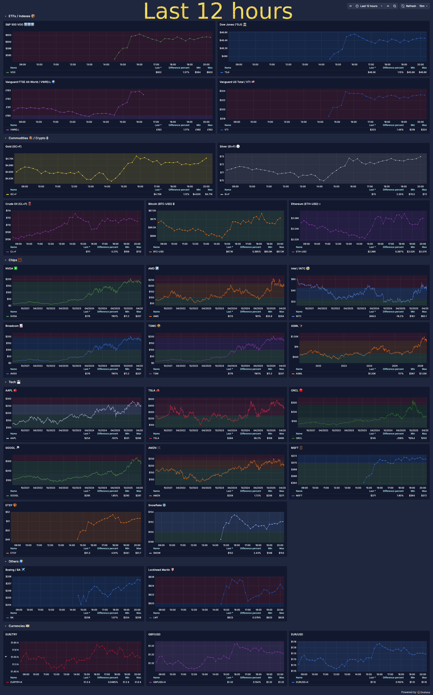
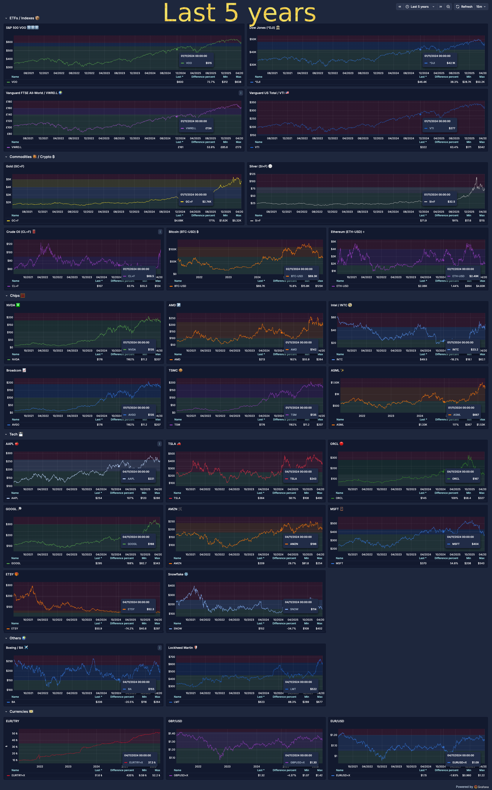

# markets-o11y

Self-hosted market observability for stocks, commodities, forex, and crypto.

```
┌────────────┐     ┌──────────────┐     ┌──────────┐
│   worker   │────>│  TimescaleDB │<────│  Grafana  │
│  (fetcher) │     │  (storage)   │     │  (UI)     │
└────────────┘     └──────────────┘     └──────────┘
     polls              stores            visualizes
  Yahoo Finance      price data          dashboards
  every 15min       (hypertable)         + alerts
```

No accounts. No API keys. No cloud. Just `docker compose up`.

> **Note:** This project uses [yfinance](https://github.com/ranaroussi/yfinance) to fetch data from Yahoo Finance. It does not distribute any data. Each user is responsible for complying with Yahoo's [Terms of Service](https://legal.yahoo.com/us/en/yahoo/terms/otos/index.html).

| Last 12 hours | Last 5 years |
|:---:|:---:|
| <a href="docs/screenshot-12h.png"></a> | <a href="docs/screenshot-5y.png"></a> |

## Getting Started

**Prerequisites:** [Docker](https://docs.docker.com/get-docker/) and [Docker Compose](https://docs.docker.com/compose/install/).

```bash
git clone https://github.com/atas/markets-o11y.git
cd markets-o11y
cp config.example.yaml config.yaml  # customize your watchlist
cp .env.example .env                # default DB & Grafana credentials
docker compose up
```

That's it. Open [http://localhost:3000](http://localhost:3000) and log in with **admin / admin**.

On first run, the worker backfills up to 10 years of daily history for every symbol, then polls every 15 minutes for intraday prices.

## Configuration

Edit `config.yaml` to add or remove symbols:

```yaml
defaults:
  fetch_interval: 15m
  history_years: 10

symbols:
  - symbol: AAPL
  - symbol: SAP.DE
    fetch_interval: 30m  # per-symbol override
  - symbol: GC=F        # Gold futures
  - symbol: EURUSD=X
  - symbol: BTC-USD
```

Any ticker supported by [yfinance](https://github.com/ranaroussi/yfinance) works:

| Type | Format | Examples |
|------|--------|----------|
| US Stocks | Plain ticker | `AAPL`, `MSFT`, `GOOGL` |
| EU Stocks | Ticker + exchange suffix | `SAP.DE`, `MC.PA`, `ASML.AS` |
| Commodities | `=F` suffix | `GC=F` (gold), `CL=F` (oil) |
| Forex | `=X` suffix | `EURUSD=X`, `GBPUSD=X` |
| Crypto | `-USD` suffix | `BTC-USD`, `ETH-USD` |
| Indices | `^` prefix | `^GSPC` (S&P 500), `^DJI` (Dow) |

See [`config.example.yaml`](config.example.yaml) for the full default watchlist.

## How It Works

The **worker** fetches OHLCV data from Yahoo Finance via yfinance and writes it to a **TimescaleDB** hypertable. **Grafana** reads from that same database with pre-provisioned dashboards.

Intraday (15-min) bars are kept until the next trading day, then automatically compacted into a single daily bar per symbol. Daily bars are kept forever.

## Legal

This is an open-source tool for **personal, non-commercial use only**. Each user is responsible for complying with the Terms of Service of their data source (e.g. [Yahoo Finance](https://legal.yahoo.com/us/en/yahoo/terms/otos/index.html)). Do not rely on this data for financial decisions — always verify with an authoritative source. Not affiliated with Yahoo Finance or any exchange.

## License

[AGPL-3.0](LICENSE)
